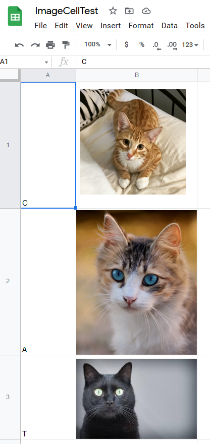
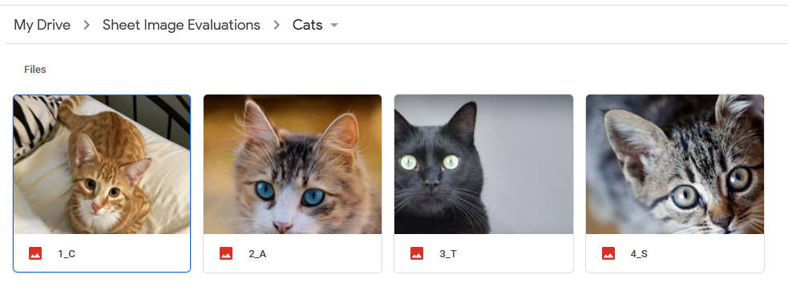

# Image Retrieval Script

## Overview

This simple script extracts images from a given Google Sheet into a specified folder on the user's Google Drive.

It is designed to parse a specific format in order to keep information about the image according to its position in the spreadsheet. See [Usage](#usage) below for more details.

### Credit
This script achieves works by using [DocsServiceApp](https://github.com/tanaikech/DocsServiceApp), a Google Scripts library by [tanaikech](https://tanaikech.github.io/about/). Please refer to that project's GitHub repository to read more about capabilities and limitations.

## Installation

1. Install [Node.js](https://nodejs.org/en/download/).

2. Install [Google Clasp](https://github.com/google/clasp#install), preferably globally.

3. Clone repository into a local directory.

4. Recommended: [Install Google Apps Script type definitions for Typescript](https://www.npmjs.com/package/@types/google-apps-script) into directory.

5. Use `clasp create --rootDir ./appsscript` 

6. Open your project in the browser with `clasp open` and [install the DocsServiceApp library](https://github.com/tanaikech/DocsServiceApp#how-to-install).

## Usage

### Spreadsheet Format



The format has a label/prompt in column A, and a corresponding image/response in column B

The starting row can vary (see below)

### Parameters

Define your parameters in appsscript/values.ts

```typescript
// values
const ssID: string = SHEET_ID; //to get images from
const genFolderName: string = 'Sheet Image Evaluations'; // root folder
const evaluationName: string = "Cats"; // sub folder
const imageRange: number = 4; // number of prompts/images
const startRow: number = 1; // row where prompts/images start
const sheetName: string = "Sheet1"; // specify a sheet to get images from
```

### Images as output

The script creates the following folder path in Google Drive: 

`/rootDrive/genFolderName/evaluationName/{all image files}`



Images are named after their corresponding prompt on the same row, with a prefix storing their position from top to bottom.

## License

[MIT](https://choosealicense.com/licenses/mit/)